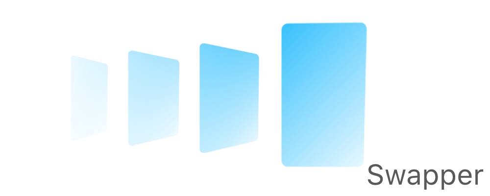

[](https://travis-ci.com/levibostian/Swapper-iOS)
[](https://cocoapods.org/pods/Swapper)
[](https://cocoapods.org/pods/Swapper)
[](https://cocoapods.org/pods/Swapper)


# Swapper

Swap between many different UIViews within your app quick and easy.



*Android developer? Check out [the Android version of Swapper!](https://github.com/levibostian/swapper-android)*

## What is Swapper?

You know those moments in your app when you have a `UITableView` that has no rows to show? You know those moments when you perform a HTTP network request and you want to show a non-blocking loading view to the user? These are very common scenarios for mobile apps. Swapper is a `UIView` that allows you to swap between a set of other `UIView`s with just 1 line of code. 

## Why use Swapper?

* Swift API
* Lightweight. Zero dependencies. 
* UI testing friendly. 
* Setup with default values that should work for 95% of your use cases. Customizable for those other cases. 
* Full test suite. [](https://travis-ci.com/levibostian/Swapper-iOS)
* [Full documentation](https://levibostian.github.io/Swapper-iOS/). 

I recommend you check out 2 other libraries that work nicely with Swapper: [Empty](https://github.com/levibostian/Empty-iOS) and [PleaseHold](https://github.com/levibostian/PleaseHold-iOS).

## Installation

Swapper is available through [CocoaPods](https://cocoapods.org/pods/Swapper). To install it, simply add the following line to your Podfile:

```ruby
pod 'Swapper', '~> version-here'
```

Replace `version-here` with: [](https://cocoapods.org/pods/Swapper) as this is the latest version at this time. 

# Getting started

* Create an instance of `SwapperView` in your `UIViewController`. You can do this with Storyboard by adding a `UIView` to Storyboard and setting the `UIView` class to `SwapperView`, or create an instance in your Swift code:

```swift
let swapperView: SwapperView = {
    let view = SwapperView()
    view.translatesAutoresizingMaskIntoConstraints = false
    view.backgroundColor = .white
    return view
}()
```

* Make sure to create the `UIView`s that you want to swap between. In this example, let's assume that I created a `UITableView` and a `UIImageView` that I want to swap between.

In your `UIViewController`, add your `UIView`s to your `SwapperView`:

```swift
import Swapper

// It's recommended to use emum over strings. It will prevent bugs by not worrying about typos. 
enum ViewControllerSwapViews: String {
    case imageView
    case tableView
}

class ViewController: UIViewController {

    override func viewDidLoad() {
        super.viewDidLoad()

        swapperView.setSwappingViews([
            (ViewControllerSwapViews.imageView.rawValue, myImageView),
            (ViewControllerSwapViews.tableView.rawValue, myTableView)
        ])
    }

}
```

Swapper is designed to automatically show the first `UIView` of the list given when you set the views. 

*Note:* Swapper will update the AutoLayout constraints of the `UIView`s you set as the swapping views. Swapper will set the size as the same size you set as the `SwapperView`. Therefore, no need to set AutoLayout constraints on your own! If you're not using AutoLayout, edit the configuration for `SwapperView` to not update the constraints: `SwapperView.defaultConfig.updateAutoLayoutConstraints = false`.

* Lastly, all you need to do is to tell Swapper to swap!

```swift
try! swapperView.swapTo(ViewControllerSwapViews.tableView.rawValue)
```

Swapper will now show the `UITableView` for you. Swapper will even fade out the `UIImageView` and fade in the `UITbleView` for you for a nice touch 👌. If you want to override the default animation, you can override the behavior yourself:

```swift
SwapperView.defaultConfig.swapToAnimateOldView = { oldView in
    // Run `UIView.animate()` function here on `oldView` to animate it out. 
}
SwapperView.defaultConfig.swapToAnimateNewView = { newView in
    // Run `UIView.animate()` function here on `newView` to animate it in. 
}
```

*Note:* `.swapTo()` will thrown an error if the id passed in was not given in `.setSwappingViews()`. 

# Configure Swapper 

Swapper works great without any configuration necessary. However, if you wish to customize it yourself, you can. 

If you want to change the default values of all instances of `SwapperView` in your app, change the values in the default singleton:

```swift
SwapperView.defaultConfig.transitionAnimationDuration = 0.8
```

Or, you can configure 1 single instance of `SwapperView`:

```swift
let swapperView = SwapperView()
var instanceConfig: SwapperViewConfig {
    let config = SwapperViewConfig()
    config.backgroundColor = instanceConfigBackgroundColor
    return config
}
swapperView.config = instanceConfig
```

For a list of all the configuration options, view the [docs on SwapperViewConfig](https://levibostian.github.io/Swapper-iOS/Classes/SwapperViewConfig.html)

# Testing with Swapper 

If you want to write tests for your app and include Swapper in it, it's highly recommended to disable animations. 

```swift
UIView.setAnimationsEnabled(false)
```

Done! Swapper inherits this property and will enable or disable animations with this setting. 

## Example

Swapper comes with an example app you can use to play with the library. To run the example project, clone the repo, and run `pod install` from the Example directory first. Then, open the workspace in XCode. 

## Development 

Swapper is a pretty simple CocoaPods library project. Follow the directions below for the optimal development experience. 

* Install cocoapods/gems and setup workspace:

```bash
$> bundle install
$> cd Swapper/Example
$> pod install
```

* Setup git hooks to run misc tasks for you when using git. 

```bash
$> ./hooks/autohook.sh install
```

The git hook scripts are installed in `hooks/`. View them if you wish. 

## Author

* Levi Bostian - [GitHub](https://github.com/levibostian), [Twitter](https://twitter.com/levibostian), [Website/blog](http://levibostian.com)


## Contribute

Swapper is open for pull requests. Check out the [list of issues](https://github.com/levibostian/swapper-ios/issues) for tasks I am planning on working on. Check them out if you wish to contribute in that way.

**Want to add features to Swapper?** Before you decide to take a bunch of time and add functionality to the library, please, [create an issue](https://github.com/levibostian/swapper-iOS/issues/new) stating what you wish to add. This might save you some time in case your purpose does not fit well in the use cases of Swapper.

## License

Swapper is available under the MIT license. See the LICENSE file for more info.
